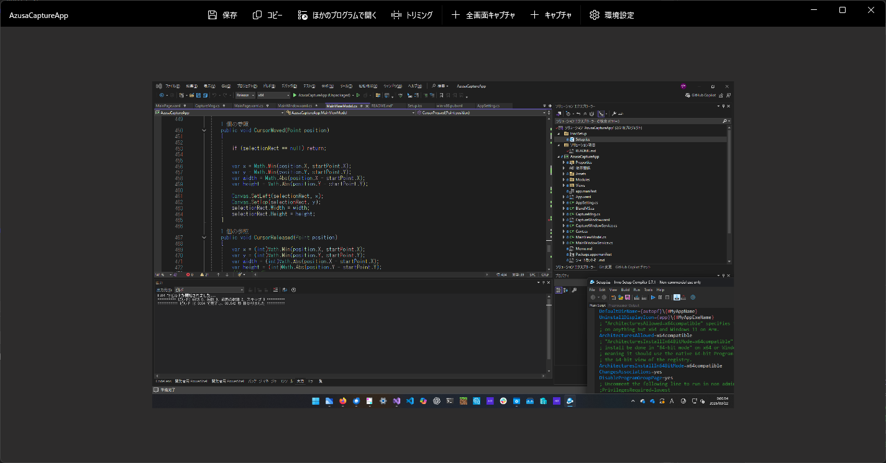

# AzusaCaptureApp
WinUI3で構築された画面静止画キャプチャアプリです。
開発途上のため反応しないボタン・不具合を含んでおります。

## インストール方法
[Releases](https://github.com/sakusan7200/AzusaCaptureApp/releases/tag/v0.2)より、インストーラーを入手できます。

## 機能
 * 静止画のキャプチャ
 * トリミング
 * タスクトレイに常駐し、アプリを立ち上げずともキャプチャできます

## ショートカットキー
<table>
  <thead>
    <tr>
      <th>キー</th> <th>効果</th>
    </tr>
  </thead>
  <tr>
    <th>(タスクトレイに常駐中に)Ctrl+PrintScreen</th> <th>全画面をキャプチャ</th>
  </tr>
</table>

## "Azusa"の由来
アニメ「けいおん！」の中野梓が由来です。
